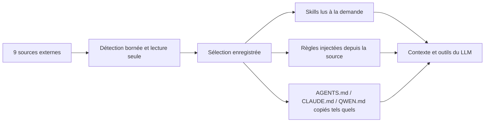

# SPEC — Importer les configurations d'autres assistants

> Statut : implémentation initiale terminée, validation manuelle en cours
>
> Date : 24 juillet 2026
>
> Périmètre : migration des instructions, règles et skills depuis les assistants compatibles
> UX retenue : Option A, avec une carte indépendante par application ou CLI

## 1. Résumé

CL-GO-DASH doit permettre à un utilisateur venant d'un autre assistant de retrouver ses instructions, ses règles et ses skills sans mélanger ni modifier les dossiers d'origine.

La solution retenue est hybride :

- CL-GO-DASH lit les skills et les règles directement dans leurs dossiers d'origine, en lecture seule.
- CL-GO-DASH copie une seule fois les documents globaux `AGENTS.md`, `CLAUDE.md` et `QWEN.md` dans son propre dossier de données.
- CL-GO-DASH injecte les trois types de documents globaux dans le contexte du LLM.
- Seul `AGENTS.md` reste visible dans l'interface Personnalité actuelle.
- `CLAUDE.md` et `QWEN.md` sont gérés uniquement depuis l'assistant d'importation.
- CL-GO-DASH ne crée, ne modifie et ne supprime jamais de fichier dans `~/.agents` ni dans un autre dossier externe.

Cette architecture évite de recopier des centaines de skills, respecte les différences entre écosystèmes et laisse l'utilisateur décider lui-même des doublons.

## 2. Décisions validées

| Sujet | Décision |
|---|---|
| Direction | Les utilisateurs arrivent des autres applications vers CL-GO-DASH. |
| Nombre de sources | 9 sources indépendantes sont proposées. |
| Sélection | Chaque source est configurée séparément. Aucun bouton n'importe toutes les applications en une fois. |
| Skills | Tous les skills détectés sont activés par défaut lors de la première configuration d'une source. |
| Sélection rapide | La section Skills propose `Tout` et `Rien`. |
| Doublons | CL-GO-DASH ne fusionne, ne supprime et ne désactive aucun doublon automatiquement. |
| Règles | Les règles sélectionnées sont lues directement dans leur dossier d'origine. |
| `~/.agents` | CL-GO-DASH le traite comme une source partagée strictement en lecture seule. |
| Documents globaux | `AGENTS.md`, `CLAUDE.md` et `QWEN.md` sont copiés tels quels dans le dossier de données de CL-GO-DASH. |
| Injection | Les trois documents globaux sont injectés dans le contexte du LLM. |
| Interface Personnalité | Seul `AGENTS.md` apparaît dans cette interface. |
| Fichiers d'identité | `SOUL.md`, `IDENTITY.md`, `USER.md` et les équivalents sont exclus. |
| Historiques et mémoire | Ils sont exclus. |
| Premier lancement | L'importation apparaît après les préférences et avant la configuration des API. |
| Importation ultérieure | Le même assistant est accessible dans Réglages > Avancé. |

## 3. Classification du produit

- Type : fonctionnalité d'une application desktop.
- Public : utilisateurs de CLI et d'applications agentiques, débutants à avancés.
- Complexité : élevée, car chaque outil possède ses propres chemins et formats.
- Stade : ajout à un produit existant.
- Valeur principale : retrouver rapidement son environnement de travail sans donner à CL-GO-DASH la propriété des configurations externes.

## 4. Utilisateurs et parcours

### Persona principal — utilisateur qui change d'assistant

- Rôle : utilisateur de Claude Code, Codex, Qwen, ZCode, Hermes, OpenCode, OpenClaw ou Kimi.
- Objectif : continuer à utiliser ses règles et ses skills dans CL-GO-DASH.
- Difficulté actuelle : les fichiers sont répartis dans plusieurs dossiers et les mêmes skills peuvent exister plusieurs fois.
- Niveau technique : variable.

### Parcours A — premier lancement

1. L'utilisateur choisit ses préférences.
2. CL-GO-DASH affiche les 9 cartes de sources.
3. L'utilisateur ouvre une carte.
4. CL-GO-DASH affiche uniquement les éléments éligibles détectés.
5. Tous les skills sont cochés par défaut.
6. L'utilisateur utilise `Tout`, `Rien` ou modifie les cases individuellement.
7. L'utilisateur confirme cette source puis revient aux cartes.
8. Il configure une autre source ou continue l'onboarding.
9. CL-GO-DASH enregistre les sélections, copie les documents globaux confirmés et conserve les skills et règles en lecture directe.

Résultat : l'utilisateur retrouve sa configuration dans CL-GO-DASH sans altérer ses outils existants.

### Parcours B — importation plus tard

1. L'utilisateur ouvre Réglages > Avancé.
2. Il ouvre `Importer depuis un autre assistant`.
3. Il retrouve les mêmes cartes et ses sélections enregistrées.
4. Il ajoute, retire ou actualise une source.
5. CL-GO-DASH applique la nouvelle sélection sans modifier les dossiers externes.

Résultat : l'utilisateur peut revenir sur sa décision après l'onboarding.

### Parcours C — source indisponible

1. Un dossier externe est déplacé, désinstallé ou momentanément inaccessible.
2. CL-GO-DASH marque la source comme indisponible.
3. Les autres sources continuent de fonctionner.
4. La sélection est conservée pour permettre une reconnexion future.

Résultat : une source manquante ne bloque ni le démarrage ni une conversation.

## 5. Critères de réussite

| Critère | Cible |
|---|---|
| Détection | Les 9 cartes sont toujours visibles et indiquent clairement si du contenu éligible est détecté. |
| Contrôle utilisateur | Aucun contenu d'une source n'est activé sans confirmation de sa carte. |
| Sélection initiale | À la première ouverture d'une source, 100 % de ses skills éligibles sont cochés. |
| Lecture seule | Zéro écriture, renommage, déplacement ou suppression dans les dossiers externes. |
| Injection | Un `CLAUDE.md` ou `QWEN.md` importé et activé apparaît réellement dans le contexte envoyé au LLM. |
| Doublons | Deux skills de même nom peuvent rester sélectionnés et sont distingués par leur source. |
| Résilience | Une source absente n'empêche pas CL-GO-DASH de démarrer ou d'envoyer un message. |
| Réversibilité | Une sélection peut être modifiée depuis Réglages > Avancé. |
| Compatibilité | Le comportement est testé sur macOS, Linux et Windows avec des dossiers utilisateur simulés. |

## 6. Périmètre

### Inclus

- Détection de 9 sources.
- Sélection indépendante de chaque source.
- Sélection individuelle des skills.
- Actions `Tout` et `Rien` pour les skills.
- Lecture directe et en lecture seule des skills sélectionnés.
- Lecture directe et injection des règles sélectionnées.
- Accès en lecture aux fichiers annexes d'un bundle de skill sélectionné.
- Copie fidèle de `AGENTS.md`, `CLAUDE.md` et `QWEN.md`.
- Injection de ces trois documents dans le contexte agent.
- Gestion explicite des conflits de documents globaux.
- Onboarding Option A.
- Réouverture depuis Réglages > Avancé.
- État indisponible et nouvelle analyse manuelle.
- Support des symlinks valides et des skills imbriqués.
- Sept langues de l'application : français, anglais, espagnol, allemand, italien, chinois et japonais.

### Exclus

- `SOUL.md`.
- Fichiers d'identité ou de personnalité déjà couverts par CL-GO-DASH.
- Mémoire, souvenirs, états du monde et profils utilisateur.
- Historiques, conversations, sessions et transcriptions.
- Clés API, tokens, credentials et autres secrets.
- Configuration des providers et modèles.
- MCP, hooks, plugins, commandes et sous-agents.
- Caches, logs, bases de données et fichiers temporaires.
- Fichiers de projet locaux venant d'un autre outil.
- Conversion automatique du contenu d'un skill vers le style CL-GO-DASH.
- Fusion ou déduplication automatique.
- Écriture dans `~/.agents` ou dans un autre dossier externe.
- Synchronisation automatique des documents globaux copiés.
- Importation de toutes les sources en une seule action.

## 7. Catalogue des 9 sources

Tous les chemins partent du dossier personnel obtenu par le système. Aucun nom d'utilisateur et aucun chemin comme `/Users/kevinh` ne doit être codé en dur.

| Source | Documents globaux éligibles | Règles éligibles | Skills éligibles | Remarques |
|---|---|---|---|---|
| Claude Code | `~/.claude/CLAUDE.md` | `~/.claude/rules/**/*.md` | `~/.claude/skills/**/SKILL.md` | Les fichiers mémoire et identité restent exclus. |
| Codex | `~/.codex/AGENTS.md` | `~/.codex/rules/**/*.md` si présent | `~/.codex/skills/**/SKILL.md` | `~/.agents` possède sa propre carte et n'est pas répété ici. Le dossier `.system` est exclu. |
| Agents partagé | `~/.agents/AGENTS.md` si présent | `~/.agents/rules/**/*.md` | `~/.agents/skills/**/SKILL.md` | Source entièrement en lecture seule. |
| Hermes Agent | Aucun document d'identité | Règles explicites si présentes dans un dossier dédié | `~/.hermes/skills/**/SKILL.md` | `SOUL.md` est toujours exclu. La recherche de skills doit être récursive. |
| Qwen Code | `~/.qwen/QWEN.md` | `~/.qwen/rules/**/*.md` et `~/.qwen/output-language.md` | `~/.qwen/skills/**/SKILL.md` | `QWEN.md` peut être absent même si Qwen est installé. |
| ZCode | `~/.zcode/AGENTS.md` | `~/.zcode/rules/**/*.md` si présent | `~/.zcode/skills/**/SKILL.md` | Les symlinks sont fréquents. Le dossier `.system` est exclu. |
| OpenClaw | `AGENTS.md` du workspace | Règles explicites du workspace si présentes | skills du workspace, `.agents/skills` du workspace et `~/.openclaw/skills` | Le workspace peut être personnalisé. `SOUL.md`, `USER.md`, `MEMORY.md` et `TOOLS.md` sont exclus. |
| OpenCode | `${XDG_CONFIG_HOME:-~/.config}/opencode/AGENTS.md` | dossier `rules` explicite si présent | `${XDG_CONFIG_HOME:-~/.config}/opencode/skills/**/SKILL.md` | Il ne faut pas chercher `~/.opencode` par défaut ni réimporter le fallback Claude sous la carte OpenCode. |
| Kimi Code | `${KIMI_CODE_HOME:-~/.kimi-code}/AGENTS.md` | dossier `rules` explicite si présent | `${KIMI_CODE_HOME:-~/.kimi-code}/skills` et ancien `~/.kimi/skills` | `.kimi`, `.kimi-code`, `.kimi-webbridge` et `.kimi-work` forment une seule carte. Les dossiers runtime ne sont pas importés. |

### Documents liés

Un document global peut référencer un autre fichier Markdown avec une syntaxe relative, par exemple `@RTK.md`.

- CL-GO-DASH affiche ces fichiers dans une section `Documents liés`.
- Ils ne sont jamais confondus avec de la mémoire.
- `SOUL.md`, `MEMORY.md`, `IDENTITY.md`, `USER.md`, les historiques, les sessions et les fichiers d'état restent exclus même s'ils sont référencés.
- L'utilisateur décide individuellement d'activer un document lié éligible.
- CL-GO-DASH conserve le dossier d'origine afin de résoudre les références sans réécrire le document copié.

## 8. État observé pendant l'investigation

Cet inventaire est un exemple de validation locale, pas une règle codée en dur.

| Source | État observé le 24 juillet 2026 |
|---|---|
| Claude Code | `CLAUDE.md`, 7 règles et 41 bundles de skills. |
| Codex | `AGENTS.md` et 88 candidats, avec de nombreux symlinks. |
| Agents partagé | 7 règles et 36 skills. |
| Hermes Agent | 73 bundles de skills, parfois imbriqués. |
| Qwen Code | 84 skills et `output-language.md`, sans `QWEN.md` global. |
| ZCode | `AGENTS.md` et 124 candidats, dont de nombreux symlinks. |
| OpenCode | Application installée, configuration dans `~/.config/opencode`, aucun contenu éligible actuel. |
| Kimi Code | Application installée, aucun document ou skill utilisateur éligible actuel. |
| OpenClaw | Non installé localement ; chemins confirmés depuis sa documentation et le dépôt Hermes. |

Plusieurs dizaines de doublons sont normaux sur la machine d'investigation. La SPEC ne demande donc aucune suppression automatique.

## 9. Architecture retenue



### 9.1 Pourquoi ne pas tout copier dans `~/.agents`

CL-GO-DASH ne doit pas alimenter automatiquement `~/.agents` :

- ce dossier peut déjà être partagé par plusieurs applications ;
- une écriture modifierait indirectement le comportement de ces applications ;
- les mêmes noms peuvent désigner des variantes adaptées à des écosystèmes différents ;
- les bundles peuvent être lourds ;
- l'origine d'un fichier deviendrait difficile à comprendre ;
- CL-GO-DASH deviendrait propriétaire d'un état partagé qu'il ne contrôle pas.

`~/.agents` reste néanmoins une source complète. Le backend peut lire les règles, les manifests et les fichiers annexes des skills sélectionnés.

### 9.2 Registre local

CL-GO-DASH enregistre uniquement les choix et les métadonnées dans :

`data_dir()/external-agent-sources.json`

Le registre contient :

- une version de schéma ;
- les 9 identifiants de sources au maximum ;
- le chemin logique et le chemin canonique de chaque racine détectée ;
- l'état activé ou désactivé ;
- le mode de sélection des skills : `all`, `none` ou `custom` ;
- les identifiants des skills sélectionnés en mode `custom` ;
- les règles sélectionnées ;
- les documents globaux importés ;
- le hash de la source et de la copie au moment de l'importation ;
- la dernière date d'analyse ;
- l'état disponible ou indisponible.

Le registre ne contient jamais le contenu des fichiers, une clé API, un token, un historique ou une configuration de provider.

L'écriture utilise le stockage privé et atomique existant.

### 9.3 Sémantique de `Tout`, `Rien` et sélection manuelle

- Première configuration d'une source : mode `all`.
- Action `Tout` : tous les skills actuels sont actifs et les nouveaux skills découverts plus tard deviennent actifs.
- Action `Rien` : aucun skill n'est actif et les nouveaux skills restent inactifs.
- Modification d'une case : passage en mode `custom`.
- Mode `custom` : les choix existants sont conservés et les nouveaux skills sont inactifs jusqu'à une décision de l'utilisateur.

Cette règle évite qu'une nouvelle installation de skill change silencieusement une configuration personnalisée.

### 9.4 Identité des skills

Le nom affiché ne peut pas servir d'identifiant, car plusieurs sources peuvent contenir `frontend-design` ou un autre nom identique.

Chaque skill reçoit :

- un `skill_id` stable et qualifié par la source ;
- un nom affiché issu du frontmatter ou du dossier ;
- une description courte ;
- une source affichable ;
- un chemin logique ;
- un dossier canonique utilisé uniquement par le backend.

Exemple conceptuel :

```text
skill_id: claude:frontend-design
name: frontend-design
source: Claude Code
```

Si deux skills portent le même nom :

- les deux restent disponibles ;
- l'interface affiche leur badge de source ;
- le LLM reçoit leur `skill_id` distinct ;
- `load_skill` charge un `skill_id`, jamais un simple nom ambigu ;
- CL-GO-DASH peut afficher un avertissement, mais ne choisit pas à la place de l'utilisateur.

### 9.5 Chargement progressif

CL-GO-DASH injecte uniquement le nom, la description et l'identifiant des skills activés dans la liste des skills disponibles.

Le corps complet du skill est lu lorsque :

- le LLM appelle `load_skill` ;
- ou l'utilisateur sélectionne explicitement le skill avec la commande `/`.

Le chargement retourne aussi le dossier racine canonique du bundle. Le LLM peut alors lire les fichiers annexes du bundle sélectionné avec les outils de lecture existants.

CL-GO-DASH ne lance aucun script pendant la détection. Une éventuelle exécution demandée par un skill reste soumise au système normal de permissions.

### 9.6 Accès en lecture séparé de l'écriture

Les racines externes sélectionnées sont ajoutées à une liste d'accès en lecture seulement.

Elles ne doivent jamais être ajoutées :

- aux chemins d'écriture ;
- à la configuration `allowed_paths` de l'utilisateur ;
- à une liste partagée utilisée indifféremment pour lire et écrire.

Le code actuel fait dériver une partie des racines d'écriture des racines de lecture. L'implémentation devra séparer ces deux décisions avant d'ajouter les sources externes.

L'accès externe est limité :

- aux règles sélectionnées ;
- aux documents liés sélectionnés ;
- au dossier complet d'un bundle de skill sélectionné ;
- aux chemins canoniques validés.

Un skill non sélectionné ne doit pas devenir lisible uniquement parce qu'il partage la même racine.

## 10. Documents globaux et injection

### 10.1 Destinations

- `AGENTS.md` → `data_dir()/AGENTS.md`
- `CLAUDE.md` → `data_dir()/CLAUDE.md`
- `QWEN.md` → `data_dir()/QWEN.md`

La copie conserve les octets du document source. CL-GO-DASH ne reformate pas, ne fusionne pas et ne réécrit pas son contenu.

Un document qui n'est pas un texte UTF-8 valide est refusé avec un message utilisateur générique, car il ne peut pas être injecté correctement.

### 10.2 Visibilité dans l'interface

- `AGENTS.md` garde son comportement actuel et reste visible dans Personnalité.
- `CLAUDE.md` n'est pas ajouté à la liste Personnalité.
- `QWEN.md` n'est pas ajouté à la liste Personnalité.
- L'état actif de `CLAUDE.md` et `QWEN.md` est géré depuis l'assistant d'importation dans Réglages > Avancé.

### 10.3 Ordre d'injection

L'ordre doit être stable :

1. `AGENTS.md` global de CL-GO-DASH ;
2. `CLAUDE.md` importé et activé ;
3. `QWEN.md` importé et activé ;
4. règles externes sélectionnées, triées par source puis par chemin logique ;
5. `AGENTS.md` du projet courant ;
6. `.cl-go/AGENTS.md` du projet ;
7. règles `.cl-go/rules` du projet.

Les instructions du projet arrivent après les instructions globales car elles sont plus spécifiques.

Chaque section possède une limite claire avec son nom et sa source. Le contenu interne reste inchangé.

Les mêmes instructions sont chargées pour :

- l'agent local principal ;
- les sous-agents qui reçoivent déjà le contexte projet ;
- l'estimation de l'utilisation du contexte.

Le mode Chat simple garde son comportement actuel et n'injecte pas ces instructions agentiques.

### 10.4 Conflits de destination

Plusieurs sources peuvent proposer un `AGENTS.md`, mais un seul fichier peut occuper `data_dir()/AGENTS.md`.

CL-GO-DASH applique les règles suivantes :

- un fichier absent ou vide peut recevoir la copie sans conflit ;
- un fichier non vide n'est jamais remplacé automatiquement ;
- si deux sources proposent le même nom de destination, l'utilisateur choisit laquelle fournit ce document ;
- remplacer un document exige une confirmation explicite ;
- la version précédente est sauvegardée dans le dossier de données avant remplacement ;
- les sauvegardes sont bornées à 5 versions par nom de document, avec éviction de la plus ancienne ;
- désactiver un document caché arrête son injection sans supprimer immédiatement sa copie ;
- aucune comparaison de hash ne se fait avec un simple `==` ; la comparaison suit la règle en temps constant du projet.

### 10.5 Mise à jour d'un document copié

La copie est ponctuelle et non synchronisée.

Lors d'une nouvelle analyse :

- si la source n'a pas changé, aucune action n'est proposée ;
- si la source a changé, CL-GO-DASH affiche `Une version plus récente est disponible` ;
- l'utilisateur choisit de conserver sa copie ou de la remplacer ;
- un remplacement reste explicite et sauvegarde la version précédente ;
- CL-GO-DASH n'écrase jamais une copie locale modifiée sans confirmation.

## 11. Règles externes

- Les règles restent dans leur dossier d'origine.
- L'utilisateur peut les activer ou les désactiver individuellement.
- Elles sont cochées par défaut lors de la première configuration de leur source.
- Elles sont relues au moment de construire le contexte, ou depuis un cache invalidé par le watcher.
- Une modification externe devient visible sans nouvelle copie.
- Une règle supprimée devient indisponible sans bloquer les autres règles.
- Aucune règle n'est exécutée pendant l'analyse.
- Aucun contenu n'est envoyé au frontend lors d'un simple scan ; le frontend reçoit uniquement les métadonnées nécessaires.

## 12. Détection et chemins

### 12.1 Résolution portable

Le backend obtient le dossier personnel via l'API système.

Il respecte les variables officielles lorsqu'elles existent :

- `XDG_CONFIG_HOME` pour OpenCode ;
- `KIMI_CODE_HOME` pour Kimi ;
- les profils et le workspace configuré pour OpenClaw.

Une variable absente revient au chemin officiel par défaut.

### 12.2 Validation

Pour chaque chemin :

1. CL-GO-DASH vérifie le type et la longueur.
2. Il refuse `..` et les chemins non valides.
3. Il résout le chemin canonique.
4. Il vérifie que la cible appartient à une racine autorisée.
5. Il applique les limites de profondeur, de quantité et de taille.
6. Il ne journalise ni contenu ni chemin personnel complet.

### 12.3 Symlinks

- Les symlinks de skills peuvent être suivis après canonicalisation.
- Le chemin logique conserve la source choisie par l'utilisateur.
- La cible canonique doit rester dans une racine externe autorisée.
- Une boucle, un lien cassé ou une cible interdite rend uniquement cet élément indisponible.
- Un même fichier ciblé par plusieurs symlinks peut apparaître plusieurs fois ; CL-GO-DASH ne le déduplique pas automatiquement.

### 12.4 Limites

| Élément | Limite V1 |
|---|---:|
| Sources logiques | 9 |
| Racines par source | 8 |
| Skills découverts par source | 512 |
| Skills découverts au total | 2 048 |
| Règles par source | 256 |
| Documents globaux par source | 3 |
| Profondeur de scan | 12 niveaux |
| Entrées visitées par source | 10 000 |
| Taille d'un manifest `SKILL.md` | 256 Kio |
| Taille d'une règle ou instruction | 256 Kio |
| Description injectée d'un skill | 160 caractères Unicode |
| Contexte total des instructions globales et règles | 200 Kio |
| Sauvegardes par document global | 5 |

Une limite dépassée n'est jamais masquée par une troncature silencieuse. L'interface demande à l'utilisateur de réduire sa sélection ou marque l'élément comme trop volumineux.

## 13. UX retenue — Option A

### 13.1 Position dans l'onboarding

Ordre final :

1. Bienvenue
2. Préférences
3. Importer depuis vos autres assistants
4. API et providers
5. Ollama, si nécessaire

L'étape d'importation peut être ignorée. Le bouton indique clairement que l'utilisateur pourra y revenir dans Réglages > Avancé.

### 13.2 Écran des sources

Les 9 cartes sont toujours affichées :

- Claude Code
- Codex
- Agents
- Hermes Agent
- Qwen Code
- ZCode
- OpenClaw
- OpenCode
- Kimi Code

Chaque carte affiche :

- l'état `Détecté`, `Aucun contenu compatible`, `Non détecté` ou `Accès refusé` ;
- le nombre de documents, règles et skills éligibles ;
- le nombre d'éléments actuellement actifs ;
- un bouton `Configurer` ou `Modifier`.

Il n'existe pas de bouton global `Tout importer`.

### 13.3 Détail d'une source

Le détail est organisé en trois sections :

1. Instructions globales
2. Règles
3. Skills

La section Skills contient :

- une recherche ;
- le compteur `X sur Y actifs` ;
- le bouton `Tout` ;
- le bouton `Rien` ;
- une case par skill ;
- le nom, la description et la source ;
- un badge en cas de nom également présent dans une autre source.

Tous les skills sont actifs par défaut lors de la première ouverture.

Les actions principales sont :

- `Annuler` : ne change rien ;
- `Confirmer cette source` : enregistre uniquement cette carte ;
- `Retour aux sources` : revient à la grille après confirmation.

### 13.4 Réglages > Avancé

La page Avancé ajoute uniquement une ligne ou une carte compacte :

`Importation depuis d'autres assistants`

Le bouton `Gérer` ouvre le même assistant que l'onboarding. La logique et les composants ne sont pas dupliqués dans `advanced-settings.tsx`.

### 13.5 Messages utilisateur

Les messages visibles restent génériques :

- `Cette source n'est plus disponible.`
- `Certains éléments n'ont pas pu être lus.`
- `Ce document existe déjà dans CL-GO-DASH.`
- `Réduisez la sélection pour respecter la limite de contexte.`
- `Les changements ont été enregistrés.`

Ils n'affichent ni chemin personnel complet, ni stack trace, ni nom interne de module.

## 14. Exigences fonctionnelles

### Détection

| ID | Exigence | Priorité |
|---|---|---|
| FR-001 | Le système affiche les 9 sources indépendantes. | Must |
| FR-002 | Le système résout les chemins depuis le dossier personnel de l'utilisateur. | Must |
| FR-003 | Le système détecte OpenCode dans son dossier XDG, sans dépendre de `~/.opencode`. | Must |
| FR-004 | Le système regroupe les quatre familles de dossiers Kimi dans une seule carte. | Must |
| FR-005 | Le système détecte le workspace OpenClaw par défaut et les emplacements personnalisés valides. | Must |
| FR-006 | Le système découvre les skills de manière récursive dans les limites définies. | Must |
| FR-007 | Le système signale une source sans contenu éligible sans la considérer comme une erreur. | Must |

### Sélection

| ID | Exigence | Priorité |
|---|---|---|
| FR-008 | Chaque source est confirmée indépendamment. | Must |
| FR-009 | Tous les skills sont sélectionnés par défaut à la première configuration. | Must |
| FR-010 | L'utilisateur peut activer tous les skills avec `Tout`. | Must |
| FR-011 | L'utilisateur peut désactiver tous les skills avec `Rien`. | Must |
| FR-012 | L'utilisateur peut modifier chaque skill individuellement. | Must |
| FR-013 | L'utilisateur peut modifier chaque règle individuellement. | Must |
| FR-014 | Une sélection personnalisée n'active pas automatiquement les nouveaux skills. | Must |
| FR-015 | Les choix restent disponibles après redémarrage. | Must |

### Skills

| ID | Exigence | Priorité |
|---|---|---|
| FR-016 | Le système lit les skills sélectionnés depuis leur source sans les copier. | Must |
| FR-017 | Le système distingue deux skills de même nom par un identifiant qualifié. | Must |
| FR-018 | Le système charge le corps complet seulement à la demande. | Must |
| FR-019 | Le système permet la lecture des fichiers annexes du bundle sélectionné. | Must |
| FR-020 | Le système n'exécute aucun script pendant la détection. | Must |
| FR-021 | La commande `/` affiche la source d'un skill en cas de doublon. | Must |
| FR-022 | Le LLM utilise un `skill_id` non ambigu pour `load_skill`. | Must |

### Instructions et règles

| ID | Exigence | Priorité |
|---|---|---|
| FR-023 | Le système copie `AGENTS.md`, `CLAUDE.md` et `QWEN.md` sans modifier leur contenu. | Must |
| FR-024 | Le système injecte les trois types de documents activés dans le contexte agent. | Must |
| FR-025 | Le système garde `CLAUDE.md` et `QWEN.md` hors de l'interface Personnalité. | Must |
| FR-026 | Le système injecte les règles externes sélectionnées. | Must |
| FR-027 | Le système respecte l'ordre d'injection défini dans cette SPEC. | Must |
| FR-028 | Le système bloque un remplacement de document non confirmé. | Must |
| FR-029 | Le système sauvegarde le document précédent avant un remplacement confirmé. | Must |
| FR-030 | Le système détecte qu'un document source copié a changé sans le synchroniser automatiquement. | Should |

### Résilience et gestion

| ID | Exigence | Priorité |
|---|---|---|
| FR-031 | Une source indisponible ne bloque pas les autres sources. | Must |
| FR-032 | Une source indisponible conserve sa sélection enregistrée. | Must |
| FR-033 | L'utilisateur peut relancer une analyse depuis Réglages > Avancé. | Must |
| FR-034 | L'utilisateur peut désactiver une source sans supprimer ses fichiers externes. | Must |
| FR-035 | L'onboarding peut être terminé sans configurer de source. | Must |
| FR-036 | Le système refuse les éléments dépassant les limites sans troncature silencieuse. | Must |

## 15. Exigences non fonctionnelles

### Sécurité

| ID | Exigence | Cible |
|---|---|---|
| NFR-S01 | Écriture externe | Aucune écriture hors du dossier de données CL-GO-DASH pendant l'importation. |
| NFR-S02 | Validation des chemins | Canonicalisation et contrôle de racine avant chaque lecture. |
| NFR-S03 | Traversal | Tout chemin contenant une traversée invalide est refusé. |
| NFR-S04 | Secrets | Aucun fichier de credentials, provider, historique ou mémoire n'est lu comme contenu importable. |
| NFR-S05 | Logs | Les logs contiennent uniquement l'identifiant de source, l'état et des compteurs. |
| NFR-S06 | Erreurs | Les erreurs utilisateur ne révèlent aucun chemin personnel ni détail interne. |
| NFR-S07 | Hash | Les comparaisons de hash suivent la comparaison en temps constant du projet. |
| NFR-S08 | Écriture locale | Le registre et les copies utilisent une écriture privée et atomique. |
| NFR-S09 | Permissions | Les autorisations de lecture externe ne deviennent jamais des autorisations d'écriture. |

### Performance et fiabilité

| ID | Exigence | Cible |
|---|---|---|
| NFR-P01 | Scan initial | Aucun contenu complet de bundle n'est chargé pour construire la liste. |
| NFR-P02 | Démarrage | Une source lente ou inaccessible ne bloque pas indéfiniment le démarrage. |
| NFR-P03 | Contexte | Seules les descriptions bornées des skills actifs sont listées dans le prompt. |
| NFR-R01 | Source supprimée | L'application continue sans crash. |
| NFR-R02 | Écriture interrompue | Le registre précédent reste valide. |
| NFR-R03 | Symlink cassé | Seul l'élément concerné devient indisponible. |
| NFR-R04 | Déterminisme | L'ordre des sources, règles et instructions est stable entre deux lancements. |

### Compatibilité et maintenance

| ID | Exigence | Cible |
|---|---|---|
| NFR-C01 | Plateformes | macOS, Linux et Windows. |
| NFR-C02 | Chemins | Aucun nom d'utilisateur codé en dur. |
| NFR-C03 | i18n | Tous les textes existent dans les 7 langues. |
| NFR-M01 | Taille des fichiers | Chaque fichier de code ou de test reste sous 200 lignes. |
| NFR-M02 | Responsabilités | Détection, registre, copie, chargement et interface restent séparés. |
| NFR-M03 | Réutilisation | L'onboarding et Réglages > Avancé utilisent le même composant métier. |

## 16. Contrat backend proposé

Les noms exacts peuvent évoluer pendant l'implémentation, mais les responsabilités restent séparées.

### Commandes de lecture

- `scan_external_agent_sources`
- `get_external_agent_source_state`
- `preview_external_agent_source`
- `list_external_agent_skills`

### Commandes de mutation locale

- `save_external_agent_source_selection`
- `set_external_agent_source_enabled`
- `import_external_instruction_document`
- `replace_external_instruction_document`
- `set_external_instruction_enabled`

Ces commandes peuvent modifier uniquement :

- le registre local ;
- les trois documents globaux dans `data_dir()` ;
- les sauvegardes locales bornées.

### Événements

- `fs:external-agent-sources-changed`
- `fs:skills-changed`
- `fs:agent-instructions-changed`

## 17. Découpage technique prévu

### Backend Rust

Créer un domaine dédié, par exemple :

```text
src-tauri/src/services/agent_import/
  mod.rs
  models.rs
  limits.rs
  paths.rs
  discovery.rs
  registry.rs
  documents.rs
  read_grants.rs
  sources/
    claude.rs
    codex.rs
    agents.rs
    hermes.rs
    qwen.rs
    zcode.rs
    openclaw.rs
    opencode.rs
    kimi.rs
```

Ajouter une commande Tauri dédiée dans `src-tauri/src/commands/agent_import.rs`.

Adapter :

- `services/agent_local/tool_skill_loader.rs` pour agréger les skills locaux et externes ;
- `services/agent_local/types_tools.rs` pour ajouter `skill_id` et l'origine ;
- `services/agent_local/tool_dispatcher.rs` et la définition `load_skill` pour utiliser `skill_id` ;
- `services/agent_local/agent_md.rs` pour charger les trois documents globaux et les règles externes ;
- `commands/agent_chat_task/common.rs` et `subagent_prompts.rs` pour conserver la même injection ;
- `commands/context_usage.rs` pour compter les nouvelles instructions et descriptions ;
- `services/agent_local/security.rs` pour séparer clairement lecture externe et écriture ;
- le watcher afin de rafraîchir les sources actives.

### Frontend React

Créer un domaine réutilisable, par exemple :

```text
src/components/agent-import/
  agent-import-wizard.tsx
  agent-source-grid.tsx
  agent-source-card.tsx
  agent-source-detail.tsx
  instruction-selection.tsx
  rule-selection.tsx
  skill-selection.tsx
  document-conflict-dialog.tsx
  agent-import.css
```

Ajouter :

- un hook de données et mutations dédié ;
- les types frontend correspondants ;
- une slide réutilisant le wizard dans l'onboarding ;
- une carte compacte dans Réglages > Avancé ;
- les clés i18n dans les sept langues.

`advanced-settings.tsx` ne doit pas absorber toute cette interface.

## 18. Écarts avec le code actuel

L'implémentation demandera bien une révision de la logique des skills :

- le chargeur actuel lit uniquement `data_dir()/skills` ;
- il ne parcourt qu'un niveau de dossiers ;
- il identifie un skill par son nom ;
- il marque toutes les sources comme `user` ;
- `load_skill` cherche le premier nom correspondant ;
- l'état frontend et les commandes `/` utilisent également le nom comme clé ;
- le bundle racine n'est pas transmis au LLM pour résoudre ses fichiers annexes.

L'injection des instructions doit aussi évoluer :

- seul `data_dir()/AGENTS.md` est chargé globalement ;
- `CLAUDE.md` et `QWEN.md` ne sont pas lus ;
- les règles globales externes ne sont pas agrégées ;
- la limite actuelle de 50 Kio ne suffit pas à exprimer une sélection multi-source sans gestion explicite.

Enfin, l'accès aux fichiers doit être durci :

- les racines externes doivent être lisibles ;
- cette extension ne doit pas élargir les racines d'écriture.

## 19. Phases d'implémentation

### Phase 1 — Contrats et sécurité

- Définir les modèles, identifiants, limites et format du registre.
- Séparer les autorisations de lecture externe des autorisations d'écriture.
- Écrire les tests de chemin, symlink, limite et absence d'écriture.

### Phase 2 — Détection des 9 sources

- Implémenter un adaptateur par source.
- Tester chaque adaptateur avec un faux dossier personnel.
- Ajouter les états détecté, vide, absent et accès refusé.

### Phase 3 — Chargeur de skills multi-source

- Introduire `skill_id`.
- Ajouter le scan récursif borné.
- Charger le corps à la demande.
- Donner un accès en lecture au bundle sélectionné.
- Adapter le prompt, les sous-agents, le slash menu et les skills actifs.

### Phase 4 — Instructions et règles

- Copier les documents globaux de manière atomique.
- Gérer les conflits, sauvegardes et changements de source.
- Injecter `AGENTS.md`, `CLAUDE.md`, `QWEN.md` et les règles dans l'ordre défini.
- Adapter le calcul d'utilisation du contexte.

### Phase 5 — Assistant partagé

- Construire les cartes et le détail d'une source.
- Ajouter `Tout`, `Rien`, recherche et sélection individuelle.
- Ajouter les avertissements de doublon et de conflit.
- Intégrer le wizard dans l'onboarding.
- Réutiliser le même wizard dans Réglages > Avancé.

### Phase 6 — Qualité finale

- Ajouter les sept traductions.
- Tester les thèmes clair et sombre.
- Tester macOS, Linux et Windows.
- Vérifier les limites et erreurs.
- Exécuter TypeScript, Cargo check, Clippy et tous les tests.
- Mettre Graphify à jour après les modifications.

## 20. Plan de tests

### Tests unitaires backend

- Résolution du dossier personnel sans nom codé en dur.
- Résolution XDG OpenCode.
- Résolution `KIMI_CODE_HOME`.
- Résolution du workspace OpenClaw.
- Détection de chaque source.
- Exclusion de `SOUL.md`, mémoire, historiques, secrets et `.system`.
- Scan récursif Hermes.
- Symlink valide, cassé, cyclique et hors racine.
- Limites de profondeur, taille et quantité.
- Registre `all`, `none` et `custom`.
- Écriture atomique et permissions privées.
- Conflit de document global.
- Sauvegardes bornées à 5.
- Comparaison de hash en temps constant.
- Ordre d'injection.
- Injection de `CLAUDE.md` et `QWEN.md`.
- Absence d'injection dans le mode Chat simple.
- Accès en lecture au bundle actif.
- Refus d'écriture externe.
- Skill de même nom dans deux sources.
- Source supprimée après enregistrement.
- Source modifiée après scan.

### Tests frontend

- Les 9 cartes sont affichées.
- Tous les skills sont cochés par défaut.
- `Tout` passe en mode `all`.
- `Rien` passe en mode `none`.
- Une case individuelle passe en mode `custom`.
- Un doublon affiche deux sources distinctes.
- Une carte vide reste compréhensible.
- Annuler ne sauvegarde rien.
- Confirmer sauvegarde uniquement la source ouverte.
- Le wizard fonctionne dans l'onboarding et dans Avancé.
- `CLAUDE.md` et `QWEN.md` n'apparaissent pas dans Personnalité.
- Les erreurs utilisent les traductions et ne révèlent pas de chemin.

### Test d'intégration principal

1. Créer un faux dossier personnel avec les 9 structures.
2. Ajouter des documents, règles, skills imbriqués, doublons et symlinks.
3. Prendre une empreinte complète des dossiers externes.
4. Configurer plusieurs sources.
5. Charger un skill de chaque source.
6. Construire un contexte avec `AGENTS.md`, `CLAUDE.md`, `QWEN.md` et des règles.
7. Modifier les sélections depuis Avancé.
8. Comparer les empreintes avant et après.

Résultat attendu : les dossiers externes sont strictement identiques avant et après.

## 21. Critères d'acceptation finaux

La fonctionnalité est prête uniquement si :

- les 9 sources sont disponibles comme choix indépendants ;
- les skills sont tous actifs par défaut dans une source nouvellement configurée ;
- `Tout`, `Rien` et la sélection individuelle fonctionnent ;
- deux skills de même nom peuvent coexister sans chargement ambigu ;
- `~/.agents` et toutes les autres sources restent strictement non modifiées ;
- le LLM peut lire les instructions et fichiers annexes d'un skill sélectionné ;
- `CLAUDE.md` et `QWEN.md` importés sont réellement injectés ;
- ils ne sont pas ajoutés à l'interface Personnalité ;
- un document global existant n'est jamais écrasé silencieusement ;
- une source absente ne bloque pas l'application ;
- aucune donnée exclue n'est importée ;
- tous les tests passent ;
- les sept langues sont complètes ;
- Graphify est à jour.

## 22. Risques et réponses

| Risque | Impact | Réponse |
|---|---|---|
| Deux skills ont le même nom | Chargement du mauvais contenu | Identifiant qualifié par source et badge visible. |
| Un symlink pointe ailleurs | Lecture non prévue | Canonicalisation et contrôle des racines autorisées. |
| Ajouter une racine de lecture autorise aussi l'écriture | Modification d'une configuration externe | Séparer obligatoirement les listes de lecture et d'écriture. |
| Une source contient beaucoup de skills | Prompt trop volumineux | Métadonnées bornées, corps chargé à la demande et limites explicites. |
| Des règles se contredisent | Comportement inattendu du LLM | Ordre stable, provenance visible et contrôle laissé à l'utilisateur. |
| Un document copié change à la source | Copie obsolète | Détection du changement et remplacement uniquement sur demande. |
| Un document global existe déjà | Écrasement de travail | Conflit bloquant, confirmation et sauvegarde locale. |
| Une application change ses chemins | Source non détectée | Un adaptateur par source et mise à jour indépendante. |
| Un fichier externe contient des instructions malveillantes | Comportement agent risqué | Sélection explicite, avertissement et permissions d'outils toujours actives. |
| Une source disparaît | Erreur au démarrage | État indisponible isolé et sélection conservée. |

## 23. Références

### Dépôts inspectés

- Hermes Agent : `/Users/kevinh/Projects/analyse-repo/hermes-agent`
- OpenCode : `/Users/kevinh/Projects/analyse-repo/opencode`

### Documentation officielle

- Codex customization : <https://developers.openai.com/codex/concepts/customization#skills>
- OpenCode rules : <https://opencode.ai/docs/rules/>
- OpenCode skills : <https://opencode.ai/docs/skills/>
- OpenCode configuration : <https://opencode.ai/docs/config/>
- Kimi data locations : <https://moonshotai.github.io/kimi-code/en/configuration/data-locations.html>
- Kimi skills : <https://moonshotai.github.io/kimi-code/en/customization/skills>
- Kimi agents : <https://moonshotai.github.io/kimi-code/en/customization/agents.html>
- Qwen skills : <https://qwenlm.github.io/qwen-code-docs/en/users/features/skills/>
- ZCode skills et import : <https://zcode.z.ai/en/docs/skill>
- ZCode agents : <https://zcode.z.ai/en/docs/agents>
- OpenClaw workspace : <https://docs.openclaw.ai/agent-workspace>
- OpenClaw skills : <https://docs.openclaw.ai/tools/skills>

## 24. Conclusion

La V1 ne doit pas être un copieur universel. Elle doit être un gestionnaire de sources explicite :

- l'utilisateur choisit ;
- CL-GO-DASH lit les skills et règles sans toucher à leur origine ;
- CL-GO-DASH possède uniquement ses copies de documents globaux ;
- le LLM reçoit réellement les instructions sélectionnées ;
- les doublons restent sous le contrôle de l'utilisateur ;
- aucune configuration externe n'est modifiée.

Cette base permet une migration propre aujourd'hui sans fermer la porte à une option de copie volontaire plus tard, si un besoin réel apparaît.
