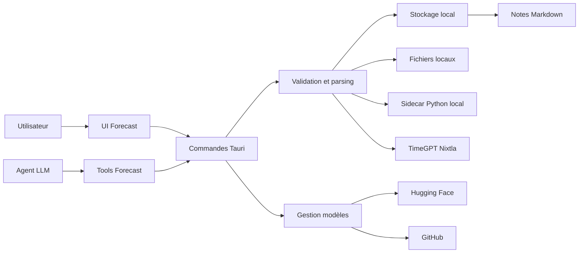

# Modèle de menace Forecast

## Executive summary

Forecast expose trois zones de risque principales : les datasets locaux qui peuvent contenir des données business sensibles, les téléchargements et l'exécution de modèles locaux depuis Hugging Face/GitHub, et les tools LLM capables de lancer Forecast librement en mode auto-permissions. Les contrôles existants sont solides sur plusieurs points importants : validation des requêtes, limites de taille, stockage dans `data_dir()`, chemins normalisés, commandes système sans shell, rendu Markdown sanitizé, token local éphémère pour le sidecar, et logs Forecast sans body HTTP brut. Les risques les plus importants restent la future ouverture aux modèles custom, la chaîne d'approvisionnement des modèles/runtimes Python, et l'abus automatisé par agent.

## Scope and assumptions

Périmètre couvert :

- Runtime Forecast côté Tauri/Rust : `src-tauri/src/commands/forecast.rs`, `forecast_details.rs`, `forecast_models.rs`.
- Services Forecast : `src-tauri/src/services/forecast/`.
- Tools LLM Forecast : `src-tauri/src/services/agent_local/tool_dispatcher_forecast*.rs`, `tool_definitions_forecast.rs`.
- UI Forecast pertinente : `src/components/forecast/`, `src/components/forecast-docs/`, hooks associés.
- Hors périmètre : CI/release, signature des binaires Tauri, sécurité générale Ollama hors interaction Forecast, comptes cloud Nixtla côté fournisseur.

Hypothèses validées par le contexte utilisateur :

- Forecast est une application desktop locale Tauri, non exposée comme serveur web public.
- Les datasets peuvent être de simples fichiers locaux ou contenir des données client/business sensibles.
- Les agents LLM peuvent lancer les tools Forecast librement en mode auto-permissions.
- Le catalogue actuel est contrôlé par l'app, mais l'objectif produit inclut l'ajout futur de modèles custom Hugging Face/GitHub.
- Le sidecar Python Forecast écoute uniquement en local sur `127.0.0.1`.

Questions ouvertes qui changeraient la priorité :

- Est-ce qu'un mode entreprise avec plusieurs utilisateurs sur la même machine est prévu ?
- Est-ce que les modèles custom devront être utilisables sans validation manuelle de source ?
- Est-ce que TimeGPT/cloud doit être autorisé par défaut pour des datasets sensibles ou nécessiter une confirmation explicite ?

## System model

### Primary components

- UI Forecast React : lance des prédictions, affiche résultats, modèles, notes et docs. Évidence : `src/components/forecast/forecast-panel.tsx`, `src/components/forecast/model-browser/model-specs.tsx`.
- Commandes Tauri Forecast : point d'entrée IPC entre UI et backend. Évidence : `src-tauri/src/commands/forecast.rs`, `src-tauri/src/commands/forecast_models.rs`, `src-tauri/src/commands/forecast_details.rs`.
- Tools LLM Forecast : point d'entrée agentique pour lancer, lire et modifier des analyses. Évidence : `src-tauri/src/services/agent_local/tool_dispatcher_forecast.rs`, `tool_dispatcher_forecast_analyze.rs`, `tool_definitions_forecast.rs`.
- Validation et parsing datasets : JSON, CSV, Excel, colonnes, fréquence, horizon, covariables. Évidence : `src-tauri/src/services/forecast/validation.rs`, `file_input.rs`, `input_data.rs`.
- Stockage local Forecast : analyses JSON, notes Markdown, modèles téléchargés. Évidence : `src-tauri/src/services/forecast/storage.rs`, `notes.rs`, `notes_files.rs`, `model_manager/mod.rs`.
- Sidecar local Python : moteur local de prédiction lancé par Tauri. Évidence : `src-tauri/src/services/forecast/sidecar.rs`, `sidecar_runtime.rs`, `sidecar_process.rs`.
- Clients externes : TimeGPT/Nixtla, Hugging Face, GitHub. Évidence : `client_nixtla.rs`, `model_details.rs`, `model_details_github.rs`, `model_manager/download.rs`, `download_github.rs`.

### Data flows and trust boundaries

- Utilisateur → UI Forecast : fichiers locaux, choix modèle, colonnes, notes, scénarios. Canal : UI Tauri. Contrôles : erreurs génériques côté UI, validation backend ensuite.
- UI Forecast → commandes Tauri : requêtes `run_forecast`, gestion analyses, modèles, notes. Canal : IPC Tauri. Contrôles : validation Rust dans `validation.rs`, `storage.rs`, `notes.rs`.
- Agent LLM → tools Forecast : JSON tool call avec `data` ou `file_path`. Canal : dispatcher interne agent. Contrôles : validation de schéma JSON, `ensure_request_data`, `validate_request`, chemin borné par `working_dir` dans le dispatcher.
- Backend Forecast → fichiers locaux utilisateur : lecture CSV/Excel. Canal : filesystem. Contrôles : `resolve_preview_path`, `validate_read_path`, limites 50 MB fichier et 5000 lignes.
- Backend Forecast → stockage app local : analyses, notes, modèles. Canal : filesystem sous `data_dir()`. Contrôles : IDs validés, écritures atomiques, limites analyses/annotations/scénarios.
- Backend Forecast → sidecar Python local : HTTP local `127.0.0.1`. Canal : HTTP local avec header `X-CLGO-Forecast-Token`. Contrôles : token CSPRNG éphémère côté Rust, comparaison constante côté Python, health check modèle, process kill ciblé, lancement sans shell.
- Backend Forecast → TimeGPT/Nixtla : datasets envoyés au cloud. Canal : HTTPS. Contrôles : clé API lue côté Rust depuis vault, jamais exposée au JS.
- Backend Forecast → Hugging Face/GitHub : métadonnées, README, poids modèles. Canal : HTTPS. Contrôles : catalogue actuel, limites GitHub, validation chemins, rendu Markdown sanitizé côté UI.

#### Diagram

## Assets and security objectives

| Asset | Why it matters | Security objective (C/I/A) |
|---|---|---|
| Datasets Forecast | Peuvent contenir données client/business sensibles | C/I |
| Analyses sauvegardées | Contiennent historiques, prédictions, covariables, scénarios | C/I/A |
| Notes Markdown | Peuvent contenir interprétations métier sensibles | C/I |
| Clé API Nixtla | Permet accès et facturation TimeGPT | C/I |
| Catalogue modèles | Détermine quel code/poids peut être téléchargé et exécuté | I/A |
| Modèles téléchargés | Données exécutées/chargées par le runtime local | I/A |
| Sidecar Python | Exécute le moteur local de prédiction | I/A |
| Répertoire `data_dir()` | Stocke analyses, notes, modèles, sidecar | C/I/A |
| Logs locaux | Peuvent révéler erreurs et fragments fournisseur/sidecar | C |

## Attacker model

### Capabilities

- Fichier CSV/Excel malveillant fourni à l'utilisateur ou utilisé par un agent.
- Agent LLM en mode auto-permissions capable d'appeler librement `forecast`, `forecast_read`, `forecast_analyze`.
- Process local non privilégié sur la même machine capable de parler à `127.0.0.1`.
- Dépôt Hugging Face/GitHub malveillant, compromis, ou trop volumineux, surtout avec les futurs modèles custom.
- README/description de modèle distant contenant HTML/Markdown hostile.
- Fournisseur cloud ou compte cloud mal configuré côté utilisateur.

### Non-capabilities

- Pas d'accès admin/root supposé.
- Pas d'exposition internet directe du sidecar Forecast.
- Pas de multi-tenant distant dans le modèle actuel.
- Pas de capacité à lire directement le vault API côté JS selon l'architecture existante.

## Entry points and attack surfaces

| Surface | How reached | Trust boundary | Notes | Evidence (repo path / symbol) |
|---|---|---|---|---|
| `run_forecast` | UI Tauri | UI → Rust | Lance parsing, modèle local/cloud, sauvegarde | `src-tauri/src/commands/forecast.rs::run_forecast` |
| `forecast` tool | Agent LLM | LLM → Rust tools | Peut lire un fichier ou envoyer JSON | `src-tauri/src/services/agent_local/tool_dispatcher_forecast.rs::handle_forecast` |
| `forecast_read` tool | Agent LLM | LLM → stockage local | Relit analyses et résultats | `tool_dispatcher_forecast.rs::handle_read` |
| `forecast_analyze` tool | Agent LLM | LLM → stockage local | Ajoute annotations/scénarios | `tool_dispatcher_forecast_analyze.rs::handle` |
| Import fichier CSV/Excel | UI/tool | Fichier local → parser | Lecture tableur, limite taille/lignes | `src-tauri/src/services/forecast/file_input.rs` |
| Stockage analyses | Backend | Rust → filesystem local | JSON local borné par ID | `src-tauri/src/services/forecast/storage.rs` |
| Notes Forecast | UI/backend | Markdown local → rendu UI/éditeur OS | Notes locales et ouverture éditeur | `src-tauri/src/services/forecast/notes.rs`, `notes_files.rs` |
| Sidecar Python | Backend | Rust → HTTP local/process | Port localhost sans auth | `src-tauri/src/services/forecast/sidecar.rs` |
| Runtime Python/pip | Backend | App → réseau/package manager | Installe dépendances sidecar | `src-tauri/src/services/forecast/sidecar_runtime.rs` |
| TimeGPT/Nixtla | Backend | App → cloud HTTPS | Envoi séries temporelles au cloud | `src-tauri/src/services/forecast/client_nixtla.rs` |
| Hugging Face downloads | Backend | App → dépôt modèle | Télécharge fichiers modèle | `src-tauri/src/services/forecast/model_manager/download.rs` |
| GitHub downloads | Backend | App → dépôt modèle | Télécharge/extrait zip | `src-tauri/src/services/forecast/model_manager/download_github.rs` |
| README modèle | Backend/UI | Web → Markdown React | Rendu avec sanitize | `src/components/forecast/model-browser/model-specs.tsx` |

## Top abuse paths

1. Exfiltration cloud involontaire : un agent en auto-permissions reçoit un fichier business sensible, lance `forecast` avec un modèle TimeGPT, le backend envoie les séries à Nixtla, la donnée quitte la machine.
2. Modèle custom compromis : l'utilisateur ajoute une source HF/GitHub custom, le modèle ou son code auxiliaire est téléchargé, le runtime local l'exécute ou le charge, l'attaquant obtient exécution sous le compte utilisateur.
3. Déni de service disque : un dépôt modèle custom référence beaucoup de gros fichiers, le téléchargement remplit le disque ou bloque l'app.
4. Sidecar local ciblé : un process local tente de parler au port `127.0.0.1` du sidecar ; le token éphémère bloque l'accès direct, mais le sidecar reste une surface locale à surveiller.
5. Poisoning d'analyse : un agent ajoute annotations/scénarios trompeurs via `forecast_analyze`, puis l'utilisateur se base sur une analyse modifiée.
6. Rendu README hostile : un README distant contient HTML/Markdown piégé, le rendu UI tente d'afficher du contenu externe ; le sanitize réduit fortement le risque mais les images/liens externes restent une surface privacy.
7. Fuite par logs locaux : un fournisseur ou sidecar renvoie un body d'erreur contenant des fragments de données. Ce risque est réduit car les clients Forecast ne loggent plus le body HTTP brut.
8. Croissance stockage local : analyses de taille maximale répétées et notes/scénarios nombreux consomment progressivement plusieurs Go.

## Threat model table

| Threat ID | Threat source | Prerequisites | Threat action | Impact | Impacted assets | Existing controls (evidence) | Gaps | Recommended mitigations | Detection ideas | Likelihood | Impact severity | Priority |
|---|---|---|---|---|---|---|---|---|---|---|---|---|
| TM-001 | Agent LLM ou utilisateur | Dataset sensible + modèle cloud sélectionné | Envoi de données business à TimeGPT/Nixtla | Confidentialité compromise hors machine | Datasets, analyses, clé Nixtla | Clé côté Rust/vault, JS ne voit pas la clé ; `client_nixtla.rs` utilise `api_keys::get_key` | Pas de garde explicite "cloud vs dataset sensible" ; auto-permissions libre | Ajouter avertissement/option "interdire cloud pour données sensibles", politique par défaut configurable, tag local/cloud visible avant exécution | Log événement local minimal : modèle cloud utilisé, taille, session, sans contenu dataset | Medium | High | High |
| TM-002 | Dépôt HF/GitHub custom compromis | Fonction custom models activée | Téléchargement d'un modèle ou code hostile | Exécution ou intégrité modèle compromise | Runtime local, modèles, `data_dir()` | Catalogue actuel contrôlé ; chemins validés dans `download.rs` et `download_github.rs` | Pas de signature/checksum/pinning obligatoire pour custom | Pour custom : afficher source complète, exiger confirmation, pin commit/revision, enregistrer hash, allowlist extensions, refuser code exécutable si non nécessaire | Journal d'installation : source, revision, taille, hash | High | High | High |
| TM-003 | Dépôt modèle trop volumineux | Modèle HF/GitHub custom ou catalogue erroné | Remplir disque / réseau par gros téléchargement | App ralentie/bloquée, disque rempli | Disponibilité app, stockage local | GitHub cap archive 200 MB/extrait 500 MB ; `download_github.rs` | HF limite nombre fichiers mais pas taille totale maximale | Ajouter `MAX_HF_TOTAL_BYTES`, limite par fichier, annulation propre, quota global `forecast-models` | Événements download annulé/trop gros, taille cumulée modèles | Medium | Medium | Medium |
| TM-004 | Process local non privilégié | Même machine utilisateur | Accès ou hijack du sidecar localhost | Intégrité/prédiction faussée, DoS local | Sidecar, résultats | Bind `127.0.0.1`, token local CSPRNG en header, `hmac.compare_digest`, health check modèle ; `sidecar.rs`, `server.py` | Course possible entre port libre et spawn ; token visible à un attaquant local très privilégié capable d'inspecter l'environnement du process | Réserver le port plus strictement si possible, vérifier PID propriétaire quand possible | Log démarrage sidecar, port, échec health, mismatch modèle | Low | Medium | Low |
| TM-005 | Runtime Python/pip ou sidecar files compromis | Sidecar ou requirements contrôlés/altérés | Installation dépendance hostile via pip | Code execution sous compte utilisateur | Sidecar, machine utilisateur | Commandes sans shell ; `sidecar_runtime.rs` limite `requirements.txt` à 16 KB | Pas de lockfile hashé, pas de mode offline/vendor | Pinner versions + hashes, vérifier intégrité sidecar, éviter `--upgrade pip` non pin si possible | Log version runtime et hash requirements | Medium | High | High |
| TM-006 | README/Markdown distant hostile | Détails modèle chargés depuis HF/GitHub | Injecter HTML/JS/liens/images externes | XSS/privacy leak possible si sanitize contourné | UI, session utilisateur | `model-specs.tsx` utilise `rehypeRaw` + `rehypeSanitize` | Images/liens distants restent chargés/affichés ; dépendance à config sanitize par défaut | Garder sanitize, interdire `data:` déjà côté backend, envisager proxy/cache images ou désactivation images externes pour custom | Compter erreurs image, domaines externes dans README | Low | Medium | Low |
| TM-007 | Agent LLM en auto-permissions | Tool access actif | Modifier analyses/scénarios/notes sans demande | Décisions utilisateur basées sur données modifiées | Analyses, notes, scénarios | IDs et tailles validés ; stockage local borné | Pas de journal clair "modifié par LLM" partout ; auto libre par design | Marquer toutes mutations LLM avec source/session, afficher indicateur visible, historique réversible | Historique local des mutations Forecast par session | Medium | Medium | Medium |
| TM-008 | Fichier local malveillant | Import CSV/Excel | Parser contenu lourd ou piégé | Crash/DoS local, erreur parsing | App, disponibilité | Limites 50 MB fichier, 5000 lignes ; `file_input.rs` | Parsing tableur reste surface complexe ; pas de sandbox séparée | Garder limites, ajouter timeout parsing, isoler parsing lourd si besoin, tests corpus fichiers corrompus | Compteur erreurs import et temps parsing | Medium | Medium | Medium |
| TM-009 | Erreur fournisseur/sidecar | Réponse d'erreur contenant données | Écriture body brut dans logs stderr | Fuite locale dans logs/debug | Datasets, erreurs internes | Erreurs UI génériques ; `client_nixtla.rs` et `client_chronos.rs` ne loggent plus le body HTTP brut | D'autres clients hors Forecast doivent rester surveillés séparément | Ajouter un test de non-régression qui vérifie l'absence de body dans les erreurs Forecast | Audit grep logs, test erreurs provider simulées | Low | Low | Low |
| TM-010 | Usage intensif local | Analyses répétées max-size | Croissance stockage local | Disque consommé progressivement | `forecast-analyses`, notes, modèles | `MAX_ANALYSES = 500`, notes/scénarios bornés | 500 analyses avec snapshots peuvent rester volumineuses | Quota global Forecast, nettoyage ancien, affichage taille Forecast | Métrique taille `forecast-analyses` et `forecast-models` | Medium | Low | Low |

## Criticality calibration

Critical :

- Exécution de code non fiable depuis un modèle custom sans confirmation ni pinning.
- Exfiltration automatique de datasets sensibles vers un service cloud sans garde.
- Compromission de clé API exposant facturation ou accès fournisseur.

High :

- Supply chain modèle/runtime avec source réseau non vérifiée.
- Action agentique libre qui modifie une analyse décisionnelle sans trace claire.
- Sidecar local ou parser permettant corruption fiable de résultats.

Medium :

- DoS local par modèle/fichier trop volumineux avec récupération possible.
- Fuite locale dans logs accessibles à l'utilisateur ou au support.
- README distant hostile fortement limité par sanitizer mais encore capable de charger ressources externes.

Low :

- Bruit UI ou erreur générique sans fuite.
- DoS nécessitant accès local déjà acquis et impact limité à la session.
- Croissance disque progressive avec quotas partiels existants.

## Focus paths for security review

| Path | Why it matters | Related Threat IDs |
|---|---|---|
| `src-tauri/src/services/agent_local/tool_dispatcher_forecast.rs` | Point d'entrée libre des agents pour lancer et lire Forecast | TM-001, TM-007 |
| `src-tauri/src/services/agent_local/tool_dispatcher_forecast_analyze.rs` | Mutations analyses/scénarios/annotations par agent | TM-007 |
| `src-tauri/src/services/forecast/client_nixtla.rs` | Envoi cloud et logging d'erreurs fournisseur | TM-001, TM-009 |
| `src-tauri/src/services/forecast/model_manager/download.rs` | Téléchargements Hugging Face, future surface custom | TM-002, TM-003 |
| `src-tauri/src/services/forecast/model_manager/download_github.rs` | Extraction zip GitHub et limites archive | TM-002, TM-003 |
| `src-tauri/src/services/forecast/sidecar_runtime.rs` | Installation Python/pip et dépendances runtime | TM-005 |
| `src-tauri/src/services/forecast/sidecar.rs` | Port localhost, health check, lifecycle sidecar | TM-004 |
| `src-tauri/src/services/forecast/file_input.rs` | Lecture CSV/Excel et limites parser | TM-008 |
| `src-tauri/src/services/forecast/storage.rs` | Persistance analyses, bornage, IDs | TM-010 |
| `src-tauri/src/services/forecast/notes.rs` | Ouverture éditeur OS et validation notes | TM-007 |
| `src-tauri/src/components/forecast/model-browser/model-specs.tsx` | Rendu README distant avec Markdown/HTML sanitizé | TM-006 |
| `src-tauri/src/services/forecast/model_details.rs` | Réécriture liens/images Hugging Face | TM-006 |
| `src-tauri/src/services/forecast/model_details_github.rs` | Réécriture liens/images GitHub | TM-006 |
| `src-tauri/src/services/forecast/validation.rs` | Contrôles centraux requête modèle/dataset | TM-001, TM-008 |
